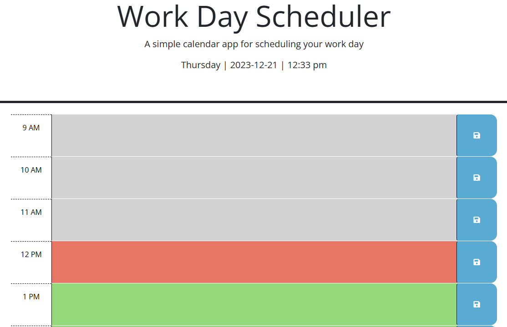
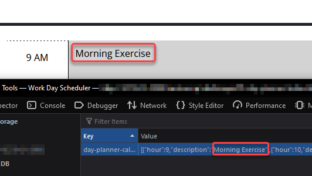

# Day Planner
## Description
This app is an exercise carried out as part of the University of Sydney and edX Coding Bootcamp curriculum. It's a single-page app that allows you to:
- See the current day, date, and time
- See what hours are in the past, present, or future
- View previously saved scheduled items
- Change the text and save events to the browser

This app touched on the use of third party APIs, notably jQuery (Bootstrap is also used, but primarily for the styling of HTML already present).

Skills leveraged in this app include:
- Initialising timers and event listeners
- DOM manipulation using jQuery
- Handling application logic using Classes (while not required for this challenge, it was fun to work in this manner)
- Retrieving and saving data to the browser's local storage for data persistence

## Preview
A screenshot of the app on first time use

A screenshot of the app demonstrating data being held in local storage

## Usage

## Credits
- Starter code (`index.html`, `style.css`, `script.js`) provided by University of Sydney and edX as part of the Online Coding Bootcamp
- Utility code for various site functionality by [jQuery](https://jquery.com/)
- Layout and some element styling by [Bootstrap](https://getbootstrap.com/)

## License
- This project is licensed under the [MIT License](./LICENSE)
- Bootstrap licensed by the Bootstrap Authors under the [MIT License](https://github.com/twbs/bootstrap/blob/main/LICENSE)
- jQuery licensed by the jQuery Foundation under the [MIT License](https://jquery.com/license/)